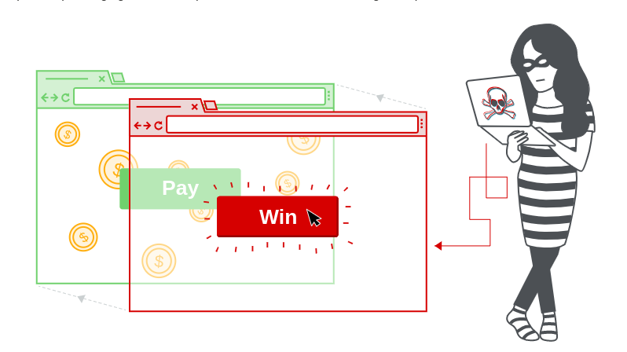

<!-- omit in toc -->
# Clickjacking
<!-- omit in toc -->
## Table of Contents
- [Basic clickjacking with CSRF token protection](#basic-clickjacking-with-csrf-token-protection)
- [Clickjacking with form input data prefilled from a URL parameter](#clickjacking-with-form-input-data-prefilled-from-a-url-parameter)
- [Clickjacking with a frame buster script](#clickjacking-with-a-frame-buster-script)

## Basic clickjacking with CSRF token protection
Reference: https://portswigger.net/web-security/clickjacking/lab-basic-csrf-protected
	@@ -29,9 +31,16 @@ Reference: https://portswigger.net/web-security/clickjacking/lab-frame-buster-sc
### Quick Solution
The exploit is **exactly** the same of the previous lab. The only difference is that the target website uses **frame busting**. This technique can easily be circumvented with the ``sandbox="allow-forms"`` attribute. Look at the ``frame_buster_script.html`` file in the ``exploits`` directory.

# Exploiting clickjacking vulnerability to trigger DOM-based XSS
Reference: https://portswigger.net/web-security/clickjacking/lab-exploiting-to-trigger-dom-based-xss

<!-- omit in toc -->
### Quick Solution
In this case there is a *Submit a feedback* page that contains a DOM-based XSS vulnerability. So the only difference in this lab is that we have to prefill the input with an XSS payload. Look at the ``dom_based_xss.html`` file in the ``exploits`` directory.

```html
<html>
    <head>
        <title>Clickjack test page</title>
    </head>
    <body>
        <iframe src="http://www.target.site" width="500" height="500"></iframe>
    </body>
</html>
```

\
*Figure 4.11.9-2: Masked inline frame illustration*
